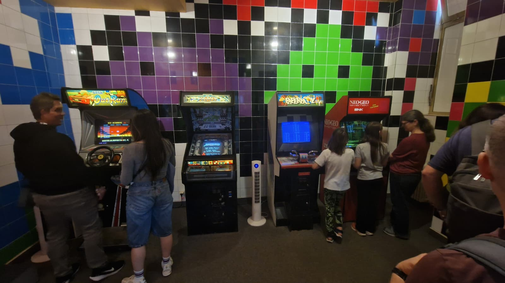
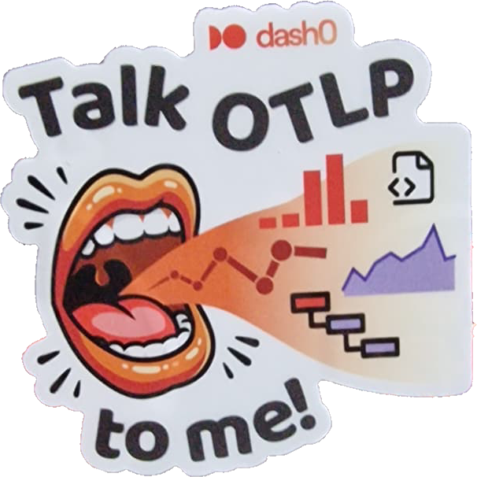
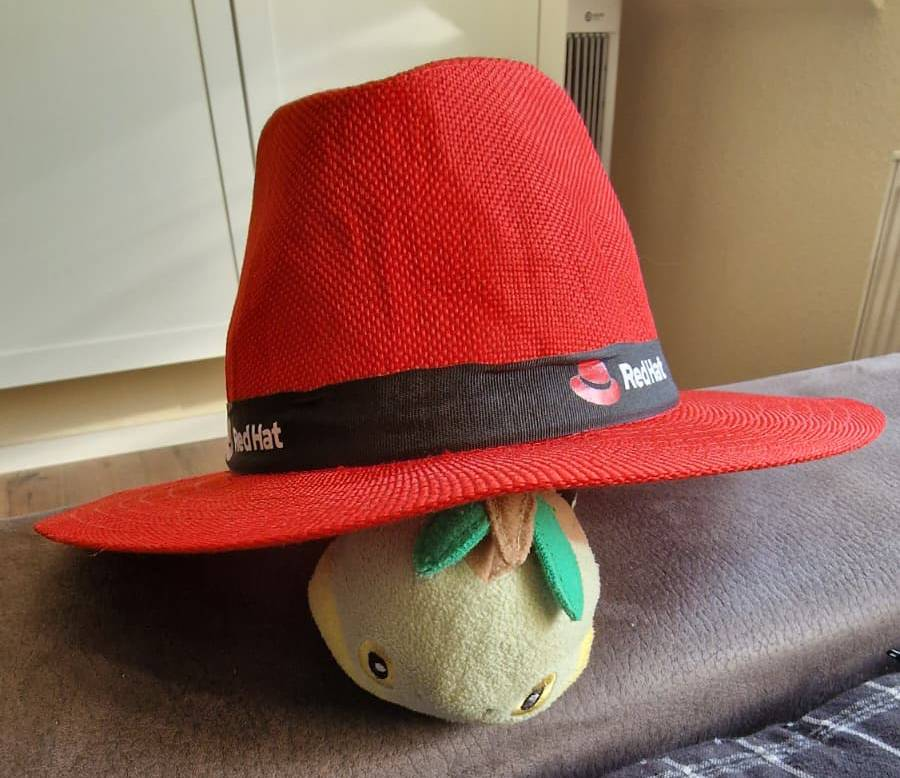

During last week, I attended the WeAreDevelopers congress in Berlin. With so many parallel tracks, topics and speakers, I want to unpack what actually happened & the highlights, from my point of view. I am going to get you through the three days and ending with some of my personal takeaways.

## Day 0

The first day was mainly a warm-up day: Badge pickup. A workshop about a geo-location pipeline which more felt like an extended advertisement. A meetup in the evening. No company booths were open yet. The congress itself really started the next day. At this point, to be honest, I was a bit worried if the whole congress would be worth the money.

A cool highlight on that day was the badge pickup itself. It was possible to do this at the [Computerspielmuseum Berlin](https://www.computerspielemuseum.de/) and with the badge came a reduced entry ticket. If you've never been there, it is probably worth a visit!

The evening meetup I mentioned was called "Hot Takes, Cold Beers: How to Evolve High-Scale Backend Systems Without Breaking Production" hosted by [GetYourGuide](https://www.getyourguide.com/de-de/). Both talks were about architectural solutions and followed a structure close to an architecture decision record: context, problem statement, solution design, consequences, rollout and measurement, and a closing summary.

The 1st presentation showed how splitting a bloated endpoint and moving denormalization into application code cut response times fourfold and database costs thirtyfold, saving about 70,000 euros a month. The second one walked through untangling two services that both owned the same data, fixed by naming one clear source of truth and migrating gradually over two quarters instead of a big-bang rewrite.

After that we called it a day and went back to the hotel since the next day was going to be a long one.

## Day 1

This is where the congress really kicked off. Now we had time for the actual talks.

I ended up collecting way more than 150 stickers for family, friends and myself, plus a bunch of other goodies along the way. My personal favorite is a "Talk OTLP to me!" sticker.

I even got a nice RedHat hat, which I should bring to the next [Chemnitzer Linux Days](https://chemnitzer.linux-tage.de/).

Focus-wise, the day leaned hard into devops, infrastructure and cloud native topics for me, with a bit of .NET mixed in.

One talk that stuck with me was Tailscale's pitch on identity-based network access. Their framing was blunt: most networks get built by opening everything up first and bolting security on afterward, even though often only a specific set of people, under specific conditions, should have access at all. Their proposal flips that order. Identity before topology, so the network actually distinguishes your personal laptop from a work machine from anything else. Policy stays central, enforcement stays distributed, all version controlled GitOps-style. The mental model is best described as sharing access like you'd share a Google Doc, not an entire network.

The .NET moment of the day came from a deep dive into RavenDB internals: interfaces with static virtual members because the JIT loves them, [`ValueTask` over `Task`](https://devblogs.microsoft.com/dotnet/understanding-the-whys-whats-and-whens-of-valuetask/), vectorization for the compute-heavy paths, and a custom "blittable JSON" format that packs a dictionary, types and a footer together for O(1) reads with smaller payloads.

Fitting given the OTLP sticker I picked up, a talk on observability pitfalls also stuck with me. The biggest one: auto-instrumentation tools, especially [eBPF](https://ebpf.io/)-based ones, capture way more than you'd expect. Unfiltered user content ends up in traces, full URLs get logged as is, raw email addresses show up instead of a hashed version. The fix is boring but necessary, filter before it leaves your service, not after. The speaker insisted on saying that most companies (also the ones we are currently working) are probably logging such things in this moment without us even realizing it.

Over-instrumentation was the other big pitfall. Spans for every single method call, metrics for health checks nobody reads, debug logs sitting in a hot production path. All of that adds cost and noise without adding signal. The talk also pushed back on designing only for the happy path. The reality is much more dirty and complex. If you get paged at night, does your instrumentation actually tell you what broke, or just that something did?

Solid day. Time to recharge for day 2.💤

## Day 2

After a long night at Berghain... (nah just joking, we sadly didn't had time for this)

My favorite talk of the whole congress landed on this day: [JSON Structure](https://json-structure.org/), presented by [Clemens Vasters](https://www.linkedin.com/in/clemensv/), one of the main contributors behind the [CloudEvents spec](https://cloudevents.io/). His point: most schema formats are tied to one specific encoding or storage technology, whether that's Avro, Thrift or Protobuf, and JSON Schema itself was built for document validation, not type definition.

JSON Structure tries to actually fix that: precise, type-specific annotations (setting precision and scale on a `decimal`, for example), compound types like tuples that serialize positionally for performance, stricter and reusable `$ref` definitions, namespaces, an `$extends` mechanism, plus built-in support for internationalization, units and currencies. A genuinely philosophical talk about what a schema is actually supposed to do. Loved it! <3

The congress closed out for me with a talk on phishing-resistant MFA. A live demo showed 3 ways to login and its security implications:

- Basic Auth with username and password, vulnerable to phishing and credential stuffing, made worse by how often people, even inside companies, still reuse weak passwords
- Push-based MFA with a mobile authenticator app like Google Authenticator, from which the session cookie can be stolen and reused by an attacker
- Passkey-based MFA with a YubiKey or your mobile phone, phishing-resistant since the session is bound to the key itself, leaving the attacker stuck at the proxy

The live demo was done by using [evilginx](https://evilginx.com/) which acts as a proxy that mirrors the real login page through a lookalike domain. (so instead of `https://login.market.de` e.g. `https://login-market.de`) I used passkeys since 2 years but never thought about how they work. ([FIDO2](https://www.microsoft.com/en-us/security/business/security-101/what-is-fido2) is a good keyword to get started in the topic; it is worth digging a bit deeper into it)

I even spotted [David Tielke](https://de.linkedin.com/in/davidtielke) around the venue, a well-known figure in the german software architecture scene with [his youtube channel](https://www.youtube.com/@DavidTielke).

## Conclusion

Definitely worth the money, especially if your employer is willing to cover it. If you need arguments to convince your team lead, here you go:

- Real production numbers from other companies, straight from the engineers who did the work, not marketing slides. The GetYourGuide meetup alone showed a 4x latency cut and a 30x database cost reduction from concrete architectural decisions.
- Direct access to spec authors and tool builders (CloudEvents, Tailscale) for questions that would otherwise take months to get answered on a mailing list.
- Security patterns you can apply immediately, like the phishing-resistant MFA demo, that reduce incident risk without waiting for a dedicated audit.
- Knowledge sharing between infrastructure, security and language-design talks that rarely happens in day-to-day work.
- Networking that turns into real contacts, troubleshooting and vendor evaluation, worth more over a year than the ticket price alone.

The focus on infrastructure and cloud native technologies paid off, and the range of talks on offer was genuinely large. For me personally it was a good mix of deep diving into topics I am familiar with and going into new rabbit holes I would not have explored otherwise.

My biggest takeaway of the congress is that it does not matter if you know nothing about a booth's topic. Just start a conversation, join a panel, ask a question during someone's presentation. That is what keeps a congress like this alive. And the best part is watching people talk about what they are passionate about and demystify it for everyone else in the room.

Maybe we will see each other at the next WeAreDevelopers congress in Berlin 2027! :)
